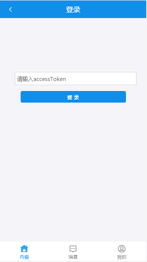
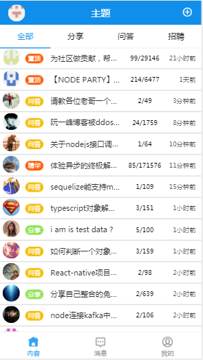
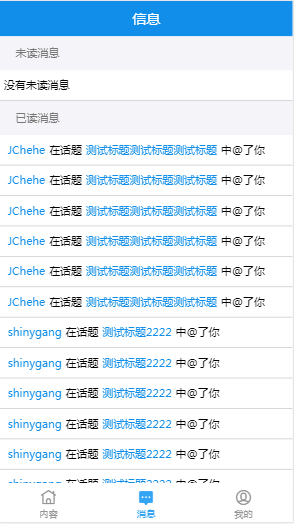
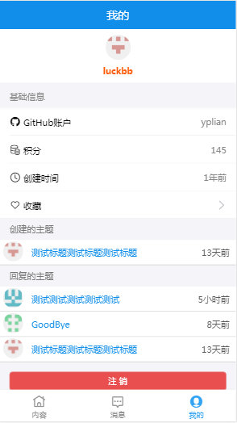
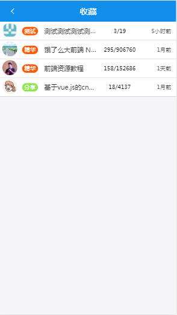
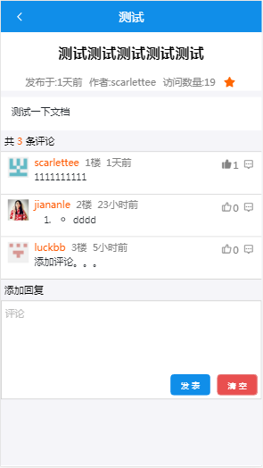
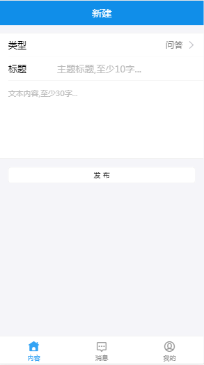

# CNode-ReactJs

## 写在前面

初次学习react生态，通过CNode社区提供的接口，实现了基本的功能。

## 开始

```js
// 下载依赖包
npm install
// 运行程序
npm run start
// 打包程序
npm run build
```

## 技术依赖

[Cnode社区API](https://cnodejs.org/api)

[Create React App](https://github.com/facebookincubator/create-react-app)

[react-router](http://reacttraining.cn/web/guides/quick-start)

[react-redux](https://github.com/reduxjs/react-redux)

[Ant Design Mobile of React](https://mobile.ant.design/docs/react/introduce-cn)

## 部分功能截图









## 实现功能

+ 主题预览、首页预览
+ 新建主题（入口在首页右上角+）
+ 主题收藏查看（入口在用户信息基础信息栏）
+ 主题评论、点赞
+ 消息通知
+ 用户信息预览
